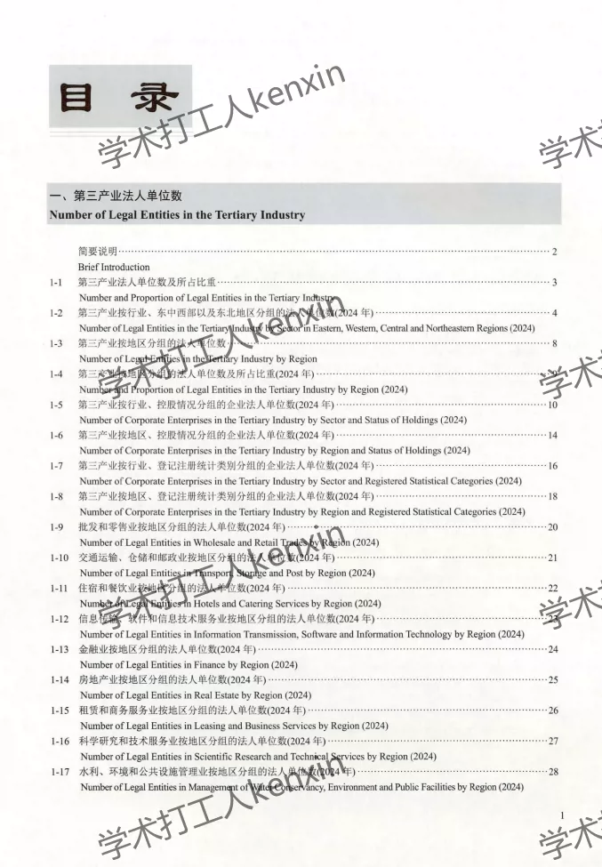
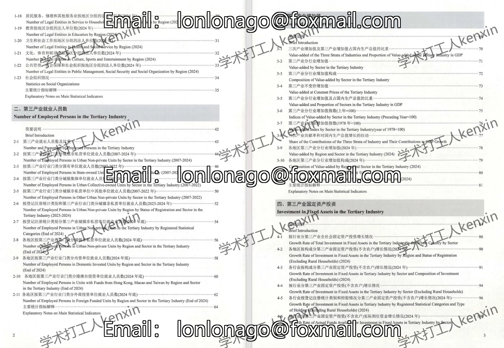
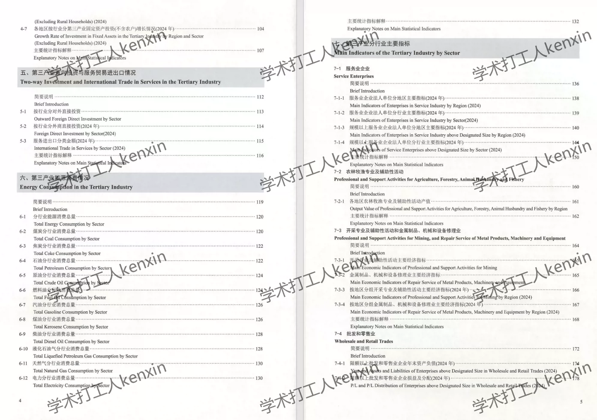
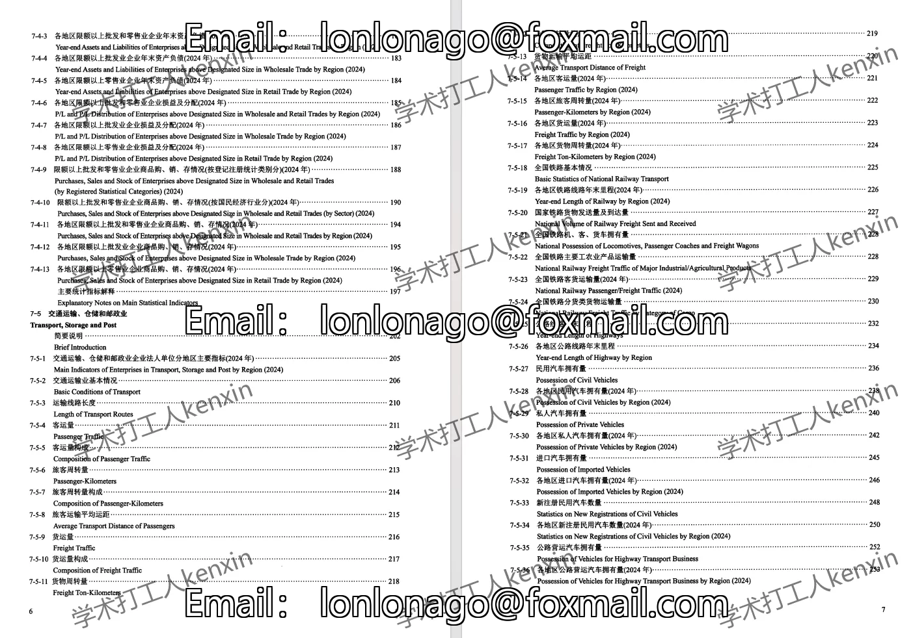
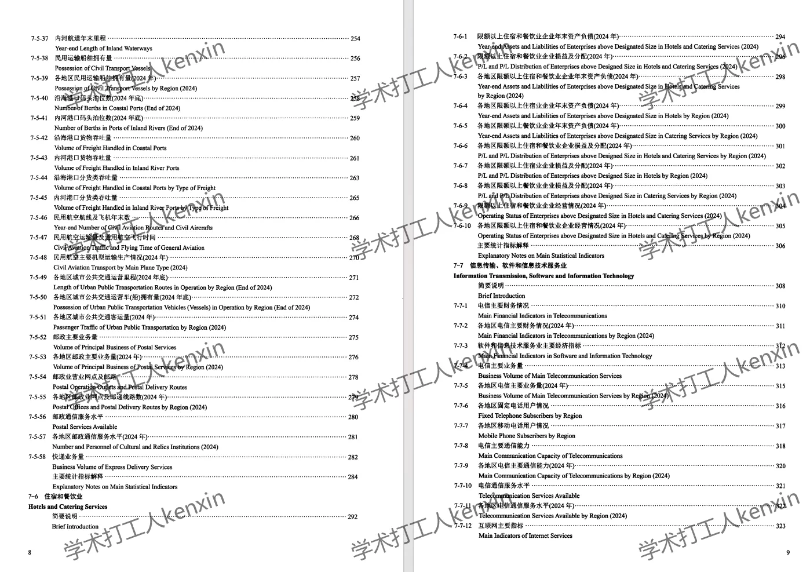
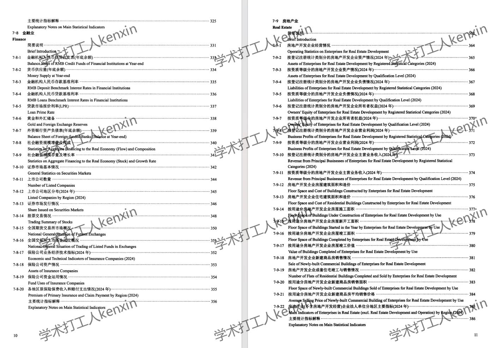
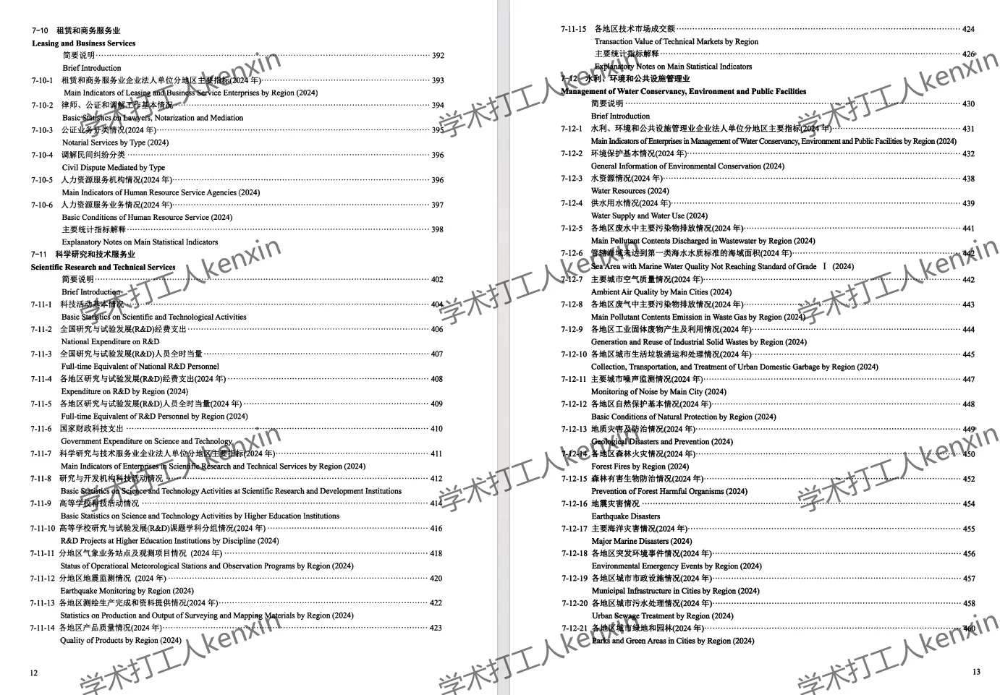
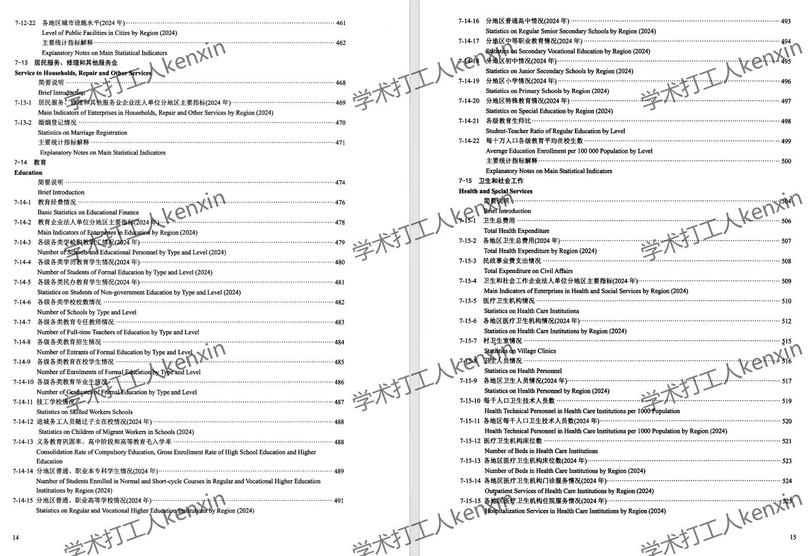

## Body

China's Third Industry Statistical Yearbook (2006-2024)

Organized Panel (2000-2020)
Year of Data: The yearbook covers the years from 2006 to 2025 (the data year should be subtracted by one).

01. Data Introduction
"China's Third Industry Statistical Yearbook"

02. Indicator Details
The directory is displayed in the picture, please view it on your own and purchase as needed. If you need help finding specific indicators, they are all here, but we do not offer refunds without a reason.
The display directory is for 2025, with a vast amount of content. For the portion shown, the rest can be accessed by replying for it. The statistical methods may vary from year to year, and academic knowledge is expected to be understood.

03. Data Content
Both PDF and Excel versions are available, both as zipped files that need to be downloaded and unzipped first. The file location is already shown in the picture, please check it before purchasing. If you have any objections, please do not proceed.

## Images

item_1073339153424

Here is a pay link on Stripe ( https://buy.stripe.com/3cs8yP7sY87d0vu9AB ). Please contact me lonlonago@foxmail.com after funding $89, and I will send you a complete data files , thank you!

